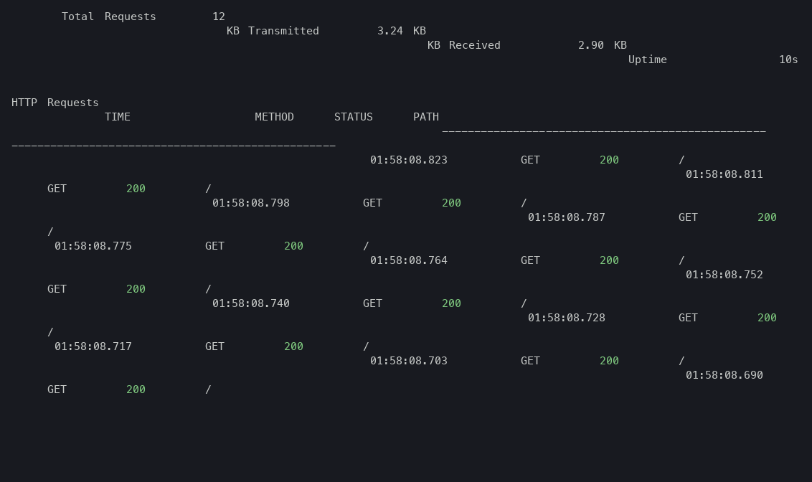
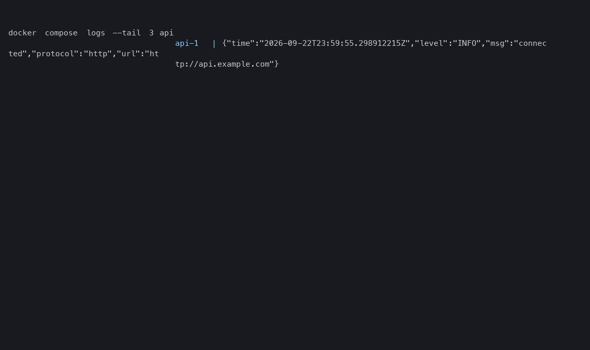
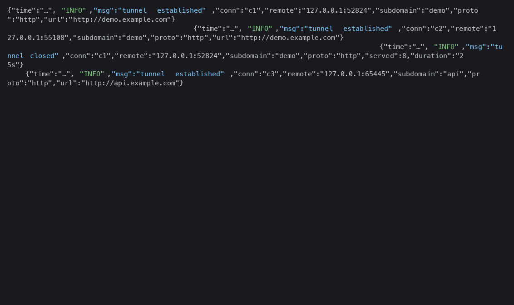

<p align="center">
  
  
  
</p>

# mygrok

A minimal, high-performance ngrok clone for personal use. Built with Go and powered by [yamux](https://github.com/hashicorp/yamux) for robust connection multiplexing and [httputil](https://pkg.go.dev/net/http/httputil) for reliable reverse proxying with **full WebSocket support**.

Run your own tunnel server on a VPS and expose local development servers (Next.js, React, LLM gateways), SSH, RDP, or any TCP/UDP port to the internet — over a single multiplexed connection, with HTTPS, custom subdomains, and a live TUI dashboard.

<p align="center">
  
</p>

---

## ✨ Features

- **Personal Infrastructure**: total control over your data, domain, and server.
- **Docker-First**: one minimal `scratch` image contains **both** the client and the server binaries (`linux/amd64` + `linux/arm64`) — run either role on Linux, macOS, or Windows (Docker Desktop). Bare static binaries remain a first-class alternative.
- **Multiplexed**: multiple concurrent HTTP requests over a single TCP connection (yamux).
- **WebSocket & HMR support**: works perfectly with Next.js, Webpack HMR, and real-time apps (connection hijack + raw splice).
- **Streaming (SSE) friendly**: no `WriteTimeout` on the proxy path — LLM token streams are never cut off.
- **TCP & UDP tunnels**: auto-assigned public ports (default range 20000–20099) for SSH, RDP, game servers, anything.
- **Multi-tunnel**: one process/container runs the whole tunnel set of a project from a single `tunnels.json` (or `<proto> <port> <sub>` triples) — N registrations, one reconnect loop each, one dashboard.
- **Hot reload**: `mygrok validate` + `mygrok reload` (nginx-style SIGHUP) apply config edits in place — new tunnels start, removed stop, and untouched tunnels keep their live connections.
- **Wildcard SSL support**: full HTTPS via Let's Encrypt wildcard certificates (DNS-01).
- **TUI dashboard**: real-time request log, traffic counters, and tunnel URLs; in multi-tunnel mode a table of all tunnels plus a detail panel, navigable with `j`/`k` (select), `r` (refresh), `q` (quit).
- **Resilient**: clients auto-reconnect with exponential backoff + jitter; the server tears tunnels down deterministically so a wedged session can't leak.
- **Observability**: loopback-only `/stats` + `/healthz` endpoints with live tunnel, in-flight, and runtime metrics.
- **Structured logging**: `log/slog` with levels and fields (`--log-level`, `--log-format json`) on both client and server.

## 🚀 Quick Start

### 1. Run the server

**One-liner (recommended).** On your VPS:

```bash
ssh your-vps
curl -fsSL https://raw.githubusercontent.com/veloriba/mygrok/main/install.sh | bash -
```

`install.sh` asks a few questions — base domain (the auth token is generated for you), image source, and the wildcard certificate (it reuses an existing Let's Encrypt directory for `*.DOMAIN` or runs the interactive `certbot --manual --dns` flow) — then installs the full stack (`mygrok-server` + nginx TLS front) into `/opt/mygrok`, verifies the front-end, and prints the client snippet plus the firewall port list. Re-running it upgrades in place (your token is preserved); `install.sh --uninstall` removes the stack. Non-interactive / air-gapped:

```bash
DOMAIN=example.com MYGROK_TOKEN=... \
  curl -fsSL https://raw.githubusercontent.com/veloriba/mygrok/main/install.sh | bash - \
  --non-interactive --image-tar /path/mygrok-0.3.0-amd64.tar.gz --cert-dir /path/certs
```

**Docker Compose (manual).** The server stack is `mygrok-server` + an nginx TLS front in one compose file:

```bash
cd deploy/docker
cp .env.server.example .env.server      # set DOMAIN and MYGROK_TOKEN
mkdir -p certs                          # wildcard cert: fullchain.pem + privkey.pem (step below)
docker compose --env-file .env.server -f docker-compose.server.yml up -d
```

Or from the repo root: `make docker-server-up` / `docker-server-status` / `docker-server-logs SERVICE=mygrok-server`.

**Getting the image** (the compose file builds it on first `up` if you have a repo checkout; otherwise provide the image and drop the `build:` block):

- **Build on the VPS from source**: `git clone https://github.com/veloriba/mygrok` and let `up` build it (or `make docker-build`).
- **Registry**: `make docker-buildx DOCKER_REGISTRY=ghcr.io/veloriba` once, then on the VPS `docker pull ghcr.io/veloriba/mygrok:<version>`.
- **Offline / air-gapped**: on any machine `make docker-save` → transfer `dist/mygrok-<version>-<arch>.tar` → `docker load -i mygrok-<version>-<arch>.tar`. For a **different target architecture** than the build machine (e.g. building on an arm64 laptop for an amd64 VPS):
  ```bash
  docker buildx build --platform linux/amd64 -f deploy/docker/Dockerfile \
    --build-arg VERSION=$(cat VERSION) -t mygrok:$(cat VERSION) --load .
  docker save mygrok:$(cat VERSION) | gzip > mygrok-$(cat VERSION)-amd64.tar.gz
  # transfer, then on the VPS: docker load -i mygrok-<version>-amd64.tar.gz
  ```

**Certificate** (see [SSL & Nginx](#2-ssl--nginx)): after issuing the wildcard cert on the VPS host, copy it into the stack:

```bash
sudo cp /etc/letsencrypt/live/DOMAIN/fullchain.pem /etc/letsencrypt/live/DOMAIN/privkey.pem deploy/docker/certs/
```

The server container runs with `network_mode: host` and binds directly on the VPS: `7000/tcp` (clients dial in), `20000-20099` tcp+udp (auto-assigned tunnel ports), and the raw HTTP front `127.0.0.1:8080` (**loopback** by default — override via `MYGROK_HTTP_ADDR`). The nginx sidecar also runs with `network_mode: host` (binding `80`/`443` directly — stop any host nginx first), so the whole chain stays loopback-local and dockerd's userland proxies are never involved. Ports are host-wide — do not run another service on them while the stack is up.

**Bare binary (alternative).** Build and install as a systemd service on an Ubuntu VPS:

```bash
cp config.mk.example config.mk          # fill SERVER_HOST/SERVER_USER/DOMAIN/TOKEN/SUDO_PWD
make server-install
```

This cross-compiles `mygrok-server`, uploads it over SSH, and installs a systemd unit that reads the token from a `0600` EnvironmentFile (it never appears in `ps`).

### 1b. Upgrading / migrating the server

- **Docker stack**: update the image (rebuild from a new repo version, `docker pull`, or `docker load` a new tarball), then run the same `up -d` command — it recreates the containers. Keep `DOMAIN` and `MYGROK_TOKEN` unchanged.
- **Bare binary**: re-run `make server-install` — it is idempotent (backs up the old binary, stops the service, swaps, restarts).
- **Migrating from a binary install to Docker** (or the reverse): stop and disable the old mechanism first (`sudo systemctl disable --now mygrok`, and stop the host nginx if the Docker sidecar should own 80/443), carry over the token (the old `/etc/mygrok/<unit>.env` file or your `config.mk`) and the existing Let's Encrypt certificate, then follow the other mode's steps. Remove the old unit/binary only after the new stack has proven itself.

No client-side changes are ever needed: every client auto-reconnects (exponential backoff, capped at 30s) and re-registers its tunnel, so the whole fleet is back within ~30s of the new server listening. If a tcp/udp client was started with an explicit `--public-port`, it reclaims the same port; clients relying on auto-assignment may get a different port from the range — prefer `--public-port` for tunnels that have hardcoded consumers.

Renew the wildcard certificate before it expires (`make cert-renew` in binary mode, or certbot on the host in Docker mode — then copy it into `certs/` and `docker compose --env-file .env.server -f docker-compose.server.yml exec nginx nginx -s reload`).

### 2. SSL & Nginx

HTTP tunnels are served on **443** through a wildcard TLS front-end: nginx terminates TLS (Let's Encrypt wildcard certificate for `*.yourdomain.com`) and proxies to `mygrok-server:8080`; mygrok dispatches each request to the right tunnel by the `Host` header.

- **Docker stack**: the nginx sidecar is already wired up — just provide the wildcard certificate in `./certs/` (see the compose header comments).
- **Bare VPS**: start from [`deploy/nginx/mygrok-nginx.conf.example`](deploy/nginx/mygrok-nginx.conf.example) — it includes the `proxy_buffering off` directive required for SSE/LLM streaming and the canonical `map`-based WebSocket upgrade handling.

Obtain the wildcard certificate with a manual DNS-01 challenge (or `make cert-renew`):

```bash
sudo certbot certonly --manual --preferred-challenges dns -d "*.yourdomain.com"
```

> Wildcard certificates cannot be issued by the HTTP-01 challenge, hence the manual DNS TXT record step.

### 3. Firewall

Only these ports need to be open on the VPS (e.g. `ufw`):

```bash
sudo ufw allow 22/tcp                 # your SSH
sudo ufw allow 7000/tcp               # mygrok control (clients dial in)
sudo ufw allow 80,443/tcp             # public HTTP/HTTPS front
sudo ufw allow 20000:20099/tcp        # tcp tunnels
sudo ufw allow 20000:20099/udp        # udp tunnels
```

Keep `8080` **closed** to the world — nginx proxies to it locally. Expect occasional `handshake decode failed` warnings in the server log: internet scanners probing the public control port. They are harmless (the connection is dropped), but if you want less noise, rate-limit or allow-list port 7000 in your firewall.

### 4. Expose a local port

**Docker (recommended).** Every tunnel is a container: `docker ps` shows all proxies at a glance, `docker logs -f <name>` streams logs, and crashed tunnels restart automatically.

```bash
cd deploy/docker
cp .env.example .env                  # set MYGROK_SERVER, MYGROK_TOKEN
make docker-up                        # or: docker compose -f deploy/docker/docker-compose.client.yml up -d
```

Add more tunnels by adding services to `docker-compose.client.yml` (one service per tunnel — see the commented `ssh` example), or run all tunnels of a project in a single container from a `tunnels.json` config file (see the commented `mygrok-multi` service in the same file, and [`docker_run_examples/06-client-multitunnel`](docker_run_examples/06-client-multitunnel/)). On air-gapped hosts, build once and transfer: `make docker-save` → `docker load -i mygrok-<version>-<arch>.tar`.

**Bare binary (alternative).**

```bash
export MYGROK_SERVER="yourdomain.com:7000"
export MYGROK_TOKEN="your-secret-token"
make build && ./bin/mygrok http 3000 my-app
```

The client TUI shows the public URL as soon as the tunnel is up.

**Many tunnels at once.** `mygrok up -f tunnels.json` (or `mygrok up http 3000 api tcp 22 ssh`) runs every tunnel of a project in one process; `mygrok validate` / `mygrok reload` apply config edits without restarting — see [Multi-tunnel & hot reload](#multi-tunnel--hot-reload).

### Per-project tunnels: the `task` CLI

For "one tunnel per project" setups, the `task` binary scaffolds and manages a self-contained `mygrok/` folder inside any project directory:

```bash
make task                                        # build bin/mygrok-task (install: cp bin/mygrok-task /usr/local/bin/mygrok-task)
mygrok-task config set                            # one-time: store MYGROK_SERVER / MYGROK_TOKEN in ~/.config/mygrok/env
mygrok-task add ~/dev/myapp --port 3000 --sub my-app
mygrok-task add ~/dev/mygame --port 8123 --sub mygame --network proxy --local-host mygame
mygrok-task add ~/dev/mybox --proto tcp --port 22 --sub ssh --public-port 2222
mygrok-task add --multi ~/dev/mybox --port 3000 --sub api
mygrok-task add --multi ~/dev/mybox --proto tcp --port 22 --sub ssh --public-port 2222
mygrok-task up|down|status|logs ~/dev/myapp
```

`add` generates `<dir>/mygrok/docker-compose.yml` (project `mygrok-<sub>`, container `mygrok_<sub>`, `restart: unless-stopped`) and `<dir>/mygrok/.env` (server + token, mode `0600`). `--network <name>` joins an existing docker network instead of `network_mode: host` (use `--local-host <container>` to target a service on that network); `--proto https` adds `--insecure` for self-signed local upstreams.

`add --multi <dir>` scaffolds a **single container that runs all tunnels** of the project from `<dir>/mygrok/tunnels.json` (project `mygrok-<dir-basename>`, container `mygrok_<dir-basename>`); every later `add --multi` appends another tunnel spec to that file (duplicate subdomains are refused), so one directory can expose many tunnels with one container. Single-mode and multi-mode directories can't be mixed — `mygrok-task` detects both conflicts.

### Multi-tunnel & hot reload

The client can run **every tunnel of a project in one process**: point `mygrok up` at a config file, or pass `<protocol> <port> <subdomain>` triples:

```bash
mygrok up -f tunnels.json
mygrok up http 3000 api tcp 22 ssh
```

Minimal `tunnels.json` (each entry supports `name`, `protocol` `http|https|tcp|udp`, `port`, `subdomain`, optional `public_port`, `insecure`, `set_headers`, and a per-tunnel `local_host`; `server`/`token` may stay empty — the `MYGROK_SERVER`/`MYGROK_TOKEN` environment supplies them, so the file is safe to commit):

```json
{
  "server": "",
  "token": "",
  "tunnels": [
    { "name": "api", "protocol": "http", "port": 3000, "subdomain": "api" },
    { "name": "ssh", "protocol": "tcp", "port": 22, "subdomain": "ssh", "public_port": 2222 }
  ]
}
```

N tunnels = N server-side registrations, but all in one process — one container (see [`docker_run_examples/06-client-multitunnel`](docker_run_examples/06-client-multitunnel/)) or one systemd unit (see the commented alternative in `systemd/mygrok-client.service`). `mygrok-task add --multi <dir> --port N --sub name` scaffolds the Docker variant for you.

#### Hot reload: `validate` and `reload`

Edit `tunnels.json` without restarting the process — two commands, nginx-style:

```bash
mygrok validate -f tunnels.json   # check the config without connecting (exit 0/1)
mygrok reload   -f tunnels.json   # validate, then SIGHUP the running process
```

The running process re-reads its own config on SIGHUP and applies the diff: new tunnels start, removed tunnels stop, changed tunnels restart — and **unchanged tunnels keep their live connections**. An invalid config is rejected at both layers: `reload` refuses to send the signal, and a bare `kill -HUP` logs `reload skipped: invalid config` while the running tunnels keep serving. The running process records its PID in `--pid-file` (default: `mygrok.pid` in the system temp dir) so `reload` can find it.

In Docker no pidfile is needed — signal the container directly:

```bash
docker kill --signal=HUP mygrok
# or, using the in-container pidfile:
docker exec mygrok mygrok reload -f /etc/mygrok/tunnels.json
```

For systemd add `ExecReload=` to the unit (see `systemd/mygrok-client.service`). Bare-Windows processes have no SIGHUP — on Windows hosts run the client in Docker.

### Runnable examples

[`docker_run_examples/`](docker_run_examples/) contains self-contained, copy-paste examples — client (http / tcp / multi-service) and server (with nginx / minimal), each with its own compose file, `.env.example`, and a `docker run` one-liner equivalent:

| Example | What it shows |
| --- | --- |
| `01-client-http` | expose a local HTTP port (host network) |
| `02-client-tcp` | forward a TCP port (e.g. SSH on `--public-port 2222`) |
| `03-client-multi` | several tunnels on one host (host network + shared docker network) |
| `04-server-nginx` | full server stack: `mygrok-server` + nginx TLS front |
| `05-server-minimal` | server without a TLS front (tcp/udp tunnels, private networks) |
| `06-client-multitunnel` | one container runs all tunnels from `tunnels.json` (multi-tunnel mode + hot reload via `docker kill --signal=HUP`) |

## 🧠 Use Cases

### Expose a local LLM gateway

Publish an OpenAI-compatible gateway (e.g. [LiteLLM](https://github.com/BerriAI/litellm) on `:4000`) from a home or dev box through your server. Because mygrok leaves `WriteTimeout` unset, **token-by-token streaming (SSE) works end to end**:

```bash
# On the gateway host (OpenAI-compatible server on :4000)
docker run --rm --network host -e MYGROK_TOKEN=... mygrok:0.3.0 \
  mygrok http 4000 llm --server yourdomain.com:7000 --no-tui
```

Then call it from anywhere through the wildcard TLS front-end:

```bash
curl https://llm.yourdomain.com/v1/chat/completions \
  -H "Authorization: Bearer sk-..." -H "Content-Type: application/json" \
  -d '{"model":"qwen","messages":[{"role":"user","content":"hi"}],"stream":true}'
```

> When fronting long-lived streams through nginx, keep `proxy_buffering off` (it is in the provided nginx templates) so intermediate buffering doesn't stall token delivery.

### Remote access: SSH / RDP / anything TCP

```bash
# tunnel local sshd :22 to public port 2222
docker run --rm --network host -e MYGROK_TOKEN=... mygrok:0.3.0 \
  mygrok tcp 22 ssh --server yourdomain.com:7000 --public-port 2222 --no-tui

# from anywhere:
ssh -p 2222 your-user@yourdomain.com
```

The same works for RDP, VNC, game servers, or any raw TCP service; UDP tunnels use the identical command with `udp`.

### Dev preview: WebSockets & HMR

```bash
docker run --rm --network host -e MYGROK_TOKEN=... mygrok:0.3.0 \
  mygrok http 3000 preview --server yourdomain.com:7000 --no-tui
```

WebSockets and HMR (Next.js, Vite) work out of the box — share `https://preview.yourdomain.com` with anyone.

### Many services, one host

Two styles, pick per host:

- **One container per tunnel** (see `docker_run_examples/03-client-multi`): `docker compose ps` becomes your fleet dashboard, and each tunnel reconnects and restarts independently.
- **One container for all tunnels** (see `docker_run_examples/06-client-multitunnel`): a single `mygrok up` process registers every tunnel from one `tunnels.json`; edit the file and hot-reload — untouched tunnels never drop:

  ```bash
  docker run -d --name mygrok --network host \
    -v "$PWD/tunnels.json:/etc/mygrok/tunnels.json:ro" \
    -e MYGROK_SERVER=yourdomain.com:7000 -e MYGROK_TOKEN=your-secret-token \
    mygrok:0.3.0 mygrok up --config /etc/mygrok/tunnels.json --no-tui --log-format json

  # later: edit tunnels.json, then
  docker kill --signal=HUP mygrok
  ```

<p align="center">
  
</p>

## 🛠 Makefile Commands

- `make build`: build client, server, and task binaries.
- `make test`: run integration and unit tests.
- `make server-install` / `server-status` / `server-uninstall`: deploy and manage the server on a VPS (binary mode).
- `make cert-renew`: trigger manual wildcard certificate renewal.
- `make run PORT=3000 SUB=name`: launch the client using `config.mk` settings.
- `make docker-build`: build the Docker image (current platform, tag from `VERSION`).
- `make docker-buildx DOCKER_REGISTRY=ghcr.io/veloriba`: build linux/amd64+arm64 and push.
- `make docker-save`: export an image tarball for offline transfer.
- `make docker-up` / `docker-down` / `docker-status` / `docker-logs SERVICE=<name>`: manage client tunnels from `deploy/docker/docker-compose.client.yml`.
- `make docker-server-up` / `docker-server-down` / `docker-server-status` / `docker-server-logs SERVICE=<name>`: manage the server stack from `deploy/docker/docker-compose.server.yml`.
- `make task`: build the `mygrok-task` CLI for per-project tunnel scaffolding.

## 🛠 Configuration

### Client

**Commands:** `http` / `https` / `tcp` / `udp` (single tunnel), `up` (N tunnels from a config file or `<proto> <port> <subdomain>` triples), `validate` (check the config without connecting), `reload` (validate, then SIGHUP the running process). Running with no subcommand reads `config.json` next to the binary (legacy single-tunnel profile; a `"tunnels"` list works there too).

| Flag | Environment Variable | Description |
| --- | --- | --- |
| `--server` | `MYGROK_SERVER` | **Required**. Server address (e.g. `yourdomain.com:7000`) |
| `--token` | `MYGROK_TOKEN` | **Required**. Authentication secret token |
| `--config` | — | Path to a profile config file (`tunnels.json` / `config.json`; default: `config.json` next to the binary) |
| `--pid-file` | — | PID file written by `up`/root (default `mygrok.pid` in the system temp dir; empty disables), read by `mygrok reload` |
| `--public-port` | — | Requested public port for `tcp`/`udp` tunnels (`0` = auto-assign) |
| `--no-tui` | — | Run headless; logs lifecycle events to stderr (for systemd/journal/compose) |
| `-v`, `--verbose` | — | Debug logging (equivalent to `--log-level debug`) |
| `--log-level` | `MYGROK_LOG_LEVEL` | `debug` \| `info` (default) \| `warn` \| `error` |
| `--log-format` | `MYGROK_LOG_FORMAT` | `text` (default) \| `json` |
| — | `MYGROK_RECONNECT_SEC` | Base reconnect interval in seconds (default `5`; backoff grows from here) |
| `--flush-interval` | `MYGROK_FLUSH_INTERVAL` | How often the reverse proxy flushes the response to the tunnel: `-1` (default) after every write (low-latency streaming), `0` only on completion, or a duration (e.g. `100ms`) for periodic flushes |
| `--local-host` | `MYGROK_LOCAL_HOST` | Local host to forward to (default `127.0.0.1`; use a container name, or `host.docker.internal` on Docker Desktop) |
| `--insecure` | `MYGROK_INSECURE` | Skip TLS certificate verification for the local upstream (for self-signed certs, e.g. the `https` subcommand) |
| `--set-header` | — | Inject a static `Key: Value` header into every proxied request (repeatable for multiple headers) |
| `--upstream-timeout` | `MYGROK_UPSTREAM_TIMEOUT` | Timeout for receiving response headers from the local upstream (default `0` = no timeout) |

### Server

| Flag | Environment Variable | Description |
| --- | --- | --- |
| `-token` | `MYGROK_TOKEN` | **Required**. Authentication secret token |
| `-domain` | — | **Required**. Base domain for tunnels (e.g. `example.com`) |
| `-control` | — | Control listener address (default `:7000`) |
| `-http` | — | Public HTTP proxy listener (default `:8080`, fronted by Nginx) |
| `-admin` | — | Loopback admin/stats listener (default `127.0.0.1:7001`; `off` to disable) |
| `-admin-token` | `MYGROK_ADMIN_TOKEN` | Optional token granting **non-loopback** access to `/stats` |
| `-port-base` / `-port-count` | — | Auto-assign port range for `tcp`/`udp` tunnels (defaults `20000` / `100`) |
| `-v` | — | Debug logging |
| `-log-level` | `MYGROK_LOG_LEVEL` | `debug` \| `info` (default) \| `warn` \| `error` |
| `-log-format` | `MYGROK_LOG_FORMAT` | `text` (default) \| `json` |

## 🪵 Logging

Both binaries use [`log/slog`](https://pkg.go.dev/log/slog) with a text handler by default (journald-friendly, single timestamp per line). Example server lines:

```text
INFO  control server listening addr=:7000
INFO  HTTP proxy listening addr=:8080
INFO  admin listener listening addr=127.0.0.1:7001 token_auth=false
INFO  tunnel established conn=c1 remote=203.0.113.7:53112 subdomain=my-app proto=http url=http://my-app.example.com
WARN  subdomain takeover, closing old session conn=c9 ... old_conn=c1 old_age=4h12m
INFO  tunnel closed conn=c9 subdomain=my-app served=18234 duration=31m2s
```

Every tunnel logs a correlation `conn` id plus the client `remote` address, so a full connect → serve → disconnect lifecycle can be traced in one `journalctl` query. Use `--log-format json` to ship structured logs to an aggregator (as in the compose templates), and `-v` when diagnosing:

<p align="center">
  
</p>

## 📊 Observability

The server exposes a **loopback-only** admin listener (default `127.0.0.1:7001`), separate from the public `:8080` front-end so metrics are never reachable over the internet:

```bash
curl -s http://127.0.0.1:7001/stats | jq
curl -s http://127.0.0.1:7001/healthz
```

(In the Docker stack the server binds the host network, so the admin listener is simply the VPS loopback: `curl http://127.0.0.1:7001/stats` from the VPS shell. To query it remotely, use `-admin-token <token>` and send `X-Mygrok-Admin-Token: <token>`, or `ssh -L 7001:127.0.0.1:7001 your-vps` and curl locally.)

`/stats` returns live operational state:

```json
{
  "now": "2026-09-06T11:00:00Z",
  "version": "0.3.0",
  "uptime": "6h23m10s",
  "tunnels": 2,
  "inflight_requests": 0,
  "tunnel_list": [
    { "subdomain": "my-app", "protocol": "http", "conn": "c9", "remote": "10.0.0.204:53112", "since": "2026-09-06T05:36:50Z", "served": 18234 },
    { "subdomain": "ssh", "protocol": "tcp", "port": 20002, "conn": "c1", "remote": "10.0.0.204:53110", "since": "2026-09-06T05:36:50Z", "served": 42 }
  ],
  "runtime": { "goroutines": 63, "num_cpu": 4, "heap_alloc_mb": 8.1, "sys_mb": 42.0, "num_gc": 210 },
  "addrs": { "control": ":7000", "http": ":8080", "admin": "127.0.0.1:7001" }
}
```

> **Why it matters:** a rising `inflight_requests` that never returns to 0, or a climbing `goroutines` count, is the early fingerprint of a stuck data path — exactly the class of failure that used to require `ss`/`ps`/`/proc` spelunking to spot. To expose the endpoint beyond localhost, set `-admin-token` (then send `X-Mygrok-Admin-Token: <token>`); without a token, only loopback callers are served.

## 📈 Resource usage

Rough figures measured on real traffic (an idle server fronting 6 tunnels):

| Component | Resident (RSS) | Notes |
| --- | --- | --- |
| `mygrok-server` | ~9 MB | Single static Go binary, ~38 goroutines at rest. Grows by a few MB under concurrent streams, then frees on idle. |
| `mygrok` (client) | ~8–9 MB each | One process per tunnel (or one `up` process for many tunnels); negligible CPU between requests. |

- Both are **statically linked Go binaries** with no runtime dependencies; the Docker image is a `scratch`-based ~10 MB layer on top of the Go toolchain build.
- `top`/`ps` will show ~1.2 GB **VIRT/VSZ** — that's Go's reserved **virtual address space** (arena hint), **not** physical memory. Watch **RSS**, not VIRT.
- Check live numbers yourself via the stats endpoint: `curl -s localhost:7001/stats | jq .runtime` (`heap_alloc_mb`, `sys_mb`, `goroutines`).
- For context: a prior build leaked yamux streams and crept up to ~145 MB over several days; the current build stays flat at ~9 MB (see [CHANGELOG](CHANGELOG.md)).

## 🏗 Architecture

```text
[User Browser] -> [Nginx :443] -> [mygrok-server :8080]   [operator] -> [:7001 /stats (loopback)]
                                           |
                                     (Yamux Stream)
                                           |
[mygrok client] <- (Control :7000) -------'
         |
[Local App :3000] (HTTP / WebSocket / SSE streaming / TCP / UDP)
```

> **Access by protocol:**
> - **HTTP tunnels** — always on port **443** via the nginx front-end (`https://subdomain.yourdomain.com`). No port assignment; nginx routes by `Host` header to mygrok `:8080`.
> - **TCP/UDP tunnels** — auto-assigned a public port from the `-port-base`/`-port-count` range (default 20000–20099). Access via `subdomain.yourdomain.com:PORT` or `your-vps-ip:PORT`. The subdomain is optional; both resolve to the same tunnel.

## 🩺 Troubleshooting

| Symptom | Likely cause | Check |
| --- | --- | --- |
| Tunnel flaps / reconnects repeatedly | Server data path wedged or client unreachable | `curl -s localhost:7001/stats` → high `inflight_requests` / `goroutines`; server log `keepalive failed` |
| `502`/timeout on a subdomain | Client offline or wrong subdomain | `GET /stats` → is the subdomain present with a recent `since`? |
| Client can't connect from Docker Desktop (macOS/Windows) | `127.0.0.1` inside the container is not the host loopback | Point `MYGROK_SERVER` at `host.docker.internal:7000`, or use a shared docker network + `--local-host host.docker.internal` |
| LLM/SSE streams arrive in bursts instead of token-by-token | Response buffering in an intermediate proxy | Ensure `proxy_buffering off` in your nginx config (included in the provided templates) |
| `handshake decode failed` spam in server log | Internet scanners hitting the public control port | Harmless — connections are dropped. Optionally rate-limit/allow-list port 7000 in the firewall |
| Client never reconnects fast enough | Frequent transient drops | Raise/fall `MYGROK_RECONNECT_SEC`; watch `attempt`/`reconnect_in` in logs |
| `reload` does nothing / "no process" | Wrong pidfile, or the process was started without a config file | Pass the same `-f`/`--pid-file` the running process uses; in Docker prefer `docker kill --signal=HUP <container>` |
| Reload silently not applied (TUI mode) | Invalid config — reload is a no-op by design | Run `mygrok validate -f <file>` to see the error; in `--no-tui` mode the log shows `reload skipped: invalid config` |
| Can't reach `/stats` from remote | Loopback-only by design | Set `-admin-token`, or `ssh -L 7001:127.0.0.1:7001 your-vps` and curl locally |

## 🤝 Contributing

Contributions are welcome! Please feel free to submit a Pull Request. Run `make test` and `make build` before submitting; keep tracked files free of any real hostnames, domains, or tokens.

## 💖 Support the Project

- [**GitHub Sponsors**](https://github.com/sponsors/veloriba)
- [**Buy Me a Coffee**](https://www.buymeacoffee.com/veloriba)

## 📄 License

This project is licensed under the MIT License - see the [LICENSE](LICENSE) file for details.
